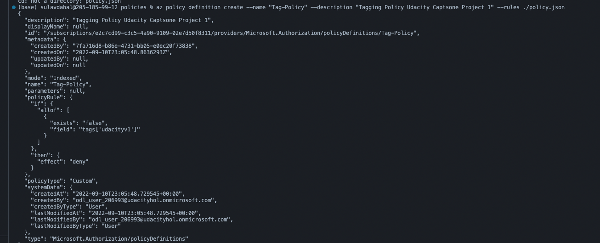
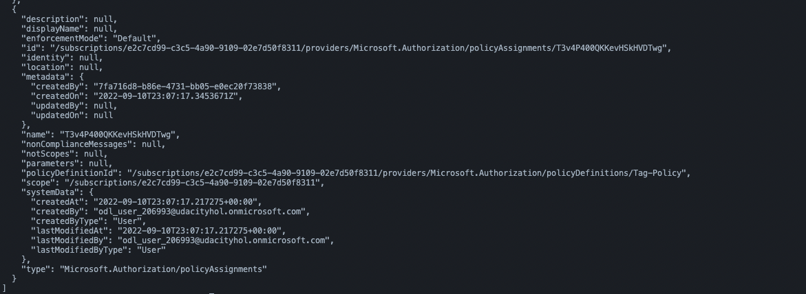
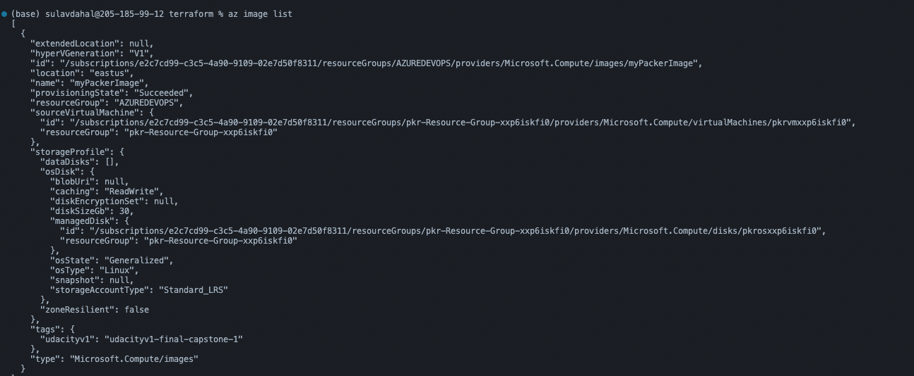
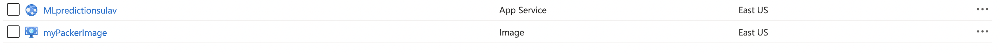
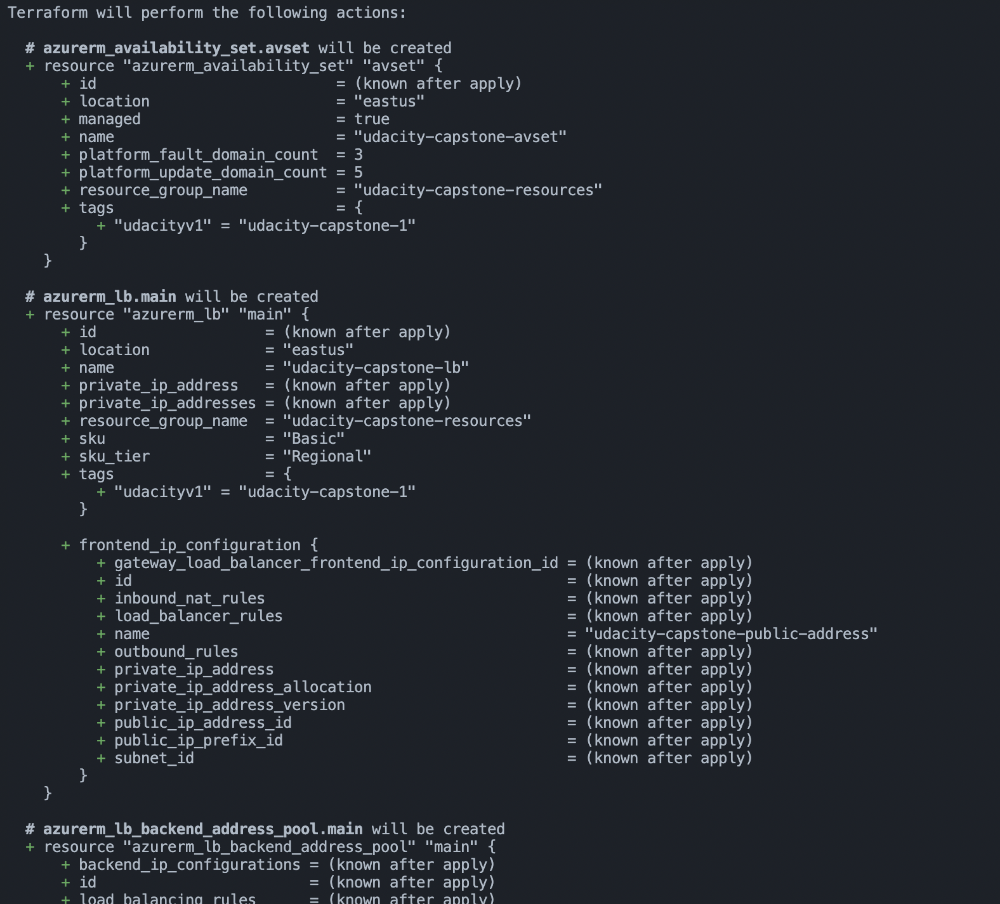
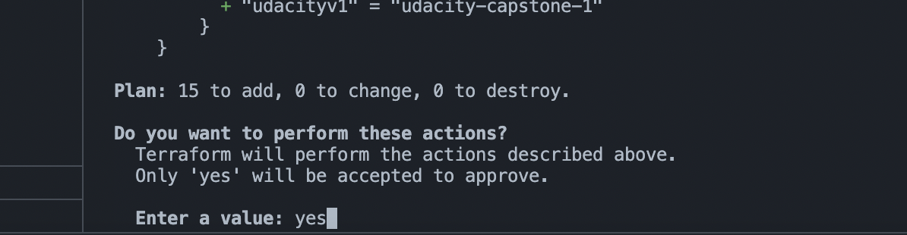

# Azure Infrastructure Operations Project: Deploying a scalable IaaS web server in Azure

### Introduction

For this project, we will write a Packer template and a Terraform template to deploy a customizable, scalable web server in Azure.

### Getting Started

1. Clone this repository

2. Install Terraform, Azure CLI, Packer [Links Provided in Dependencies Section]

3. Create Azure Policy

4. Create Resource Group

5. Create Service Principle

6. Update Packer Image and Upload in the Resource Group

7. Create main.tf, vars.tf, and Deploy the Terraform Plan

### Dependencies

1. Create an [Azure Account](https://portal.azure.com)
2. Install the [Azure command line interface](https://docs.microsoft.com/en-us/cli/azure/install-azure-cli?view=azure-cli-latest)
3. Install [Packer](https://www.packer.io/downloads)
4. Install [Terraform](https://www.terraform.io/downloads.html)

### Instructions

Instructions 1 and 2 are pretty easy so let's begin working from the third instruction.

- Create Az Policy

  ```
      # Make sure you are logged in to your azure account

      # Step 1. Create Definition
      az policy definition create --name "Tag-Policy" --description "This is tagging Policy" --rules ./policy.json

      # Step 2. Create Assignment

      az policy assignment create --policy Tag-Policy
  ```

  > Note: Make sure the policy name matches in both defintion and assignment

  

  Let's Make sure that Policy is created by using the following command.

  ```
      az policy assigment list
  ```

  `

- Create Resource Group

  ```
  # Portal
      - Create a Resource Group via Azure Portal
  # OR CLI

  az group create --location <location of your resource group> --name <name of your resource group> --tags "udacityv1"
  ```

  > Note : Since I created a policy I need to assign the tag else the resource won't be created.

- Create Service Plan

  ```
  *Note - If you are using Udacity Lab - They will provide you with the Service Principle Credentials

  Please follow the command if you are using your own account to create a service plan

  # Create a service principal with required parameter
  az ad sp create-for-rbac --scopes /subscriptions/mySubscriptionID

  # Create a service principal for a resource group using a preferred name and role
  az ad sp create-for-rbac --name myServicePrincipalName \
                          --role reader \
                          --scopes /subscriptions/mySubscriptionID/resourceGroups/myResourceGroupName
  ```

  > Resource: [Azure Active Directory Service Plan](https://docs.microsoft.com/en-us/cli/azure/create-an-azure-service-principal-azure-cli)

  Once you create Service Plan you will be Provided with following credentials

  1. Client Id == ApplicationID
  2. ClientSecret == secretKey
  3. SubscriptionID
  4. TenantId

  Save this credentials as it will be useful to create a packer image and provison resources using Terraform.

- Deploy Packer Image

  ```
  # Before Running this command you should have a server.json file ready to build

  packer build ./packer/server.json

  #Once you are done with the deployment use the following command to see if it was deployed successfully

  az image list
  ```

  

  

- Deploy Infrastructure with terraform

  > Great Job! This is our Final Step

  ```
  # Before using this command make sure you have your main.tf file
  terraform init
  ```

  Once you apply the above command you should see something like this

  

  > Note if you get any error in this particular section. Please follow the direction provided in your terminal.It should be easy.

  ```
  # Apply this command to create a plan

  terraform plan -out <filename>
  ```

  Once you are done with this step. It should save a plan in your directory

  ```
  # Good Job Final Step. Apply the infrastructure

  terraform apply
  ```

  You should see a prompt something like this. Type Yes and you'r done. Kudos ✌️
  

### Output

Once you are done with everything. Terrform Should create a scalable Web Server which comprises the following resources:

1. Resource Group
2. Virtual Network and Subnet on that Virtual Network
3. Network Security Group
4. Network Interface Card
5. Public IP
6. Load Balancer
7. Availability Set
8. Virutal Machine
9. Disks
